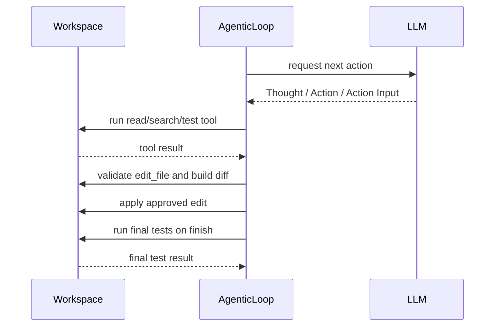
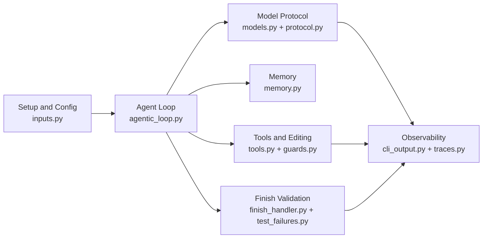

# Ark

<p align="center">
  
</p>

Ark is a didactic Python project for studying how to build a small code agent.
It is an ongoing research project developed by [ASERG](https://aserg.labsoft.dcc.ufmg.br/) at DCC/UFMG.

For more information, check our [paper](https://arxiv.org/abs/2608.10934).

## Overview

Ark is intentionally small.
It focuses on one narrow workflow:

1. load a workspace
2. copy it to an internal runtime directory
3. load the task prompt and optional workspace instructions
4. let the model inspect the copied workspace through a small tool API
5. let the model propose exact-match file edits
6. show every proposed edit as a generated diff and request user approval
7. preserve approved edits while the model iterates on failures
8. run final tests only when the model explicitly finishes

The project is meant for learning, experimentation, and research rather than broad production automation.

## Design Principles

- Ark keeps the architecture intentionally small and readable.
- Ark isolates edits in a copied runtime workspace instead of modifying the original input workspace.
- Ark uses a single OpenAI-compatible chat API in the documented setup.

## Quick Start

Setup:

```bash
python3 -m venv .venv
source .venv/bin/activate
python -m pip install -r requirements.txt
export OPENAI_API_KEY="your_key_here"
```

Run:

```bash
python run_ark.py ./test_workspace/bugfix_001_date_range
```

The default configuration calls the OpenAI API directly.
If you want another OpenAI-compatible provider, set `openai_base_url` in `config/config.json`.
If you want to use a local Ollama model, switch `model` to `ollama` and set `ollama_model`.

What you should expect during a run:

- Ark prints the selected model and the loaded `prompt.txt`
- it creates or refreshes `./ark-workspace`
- the model chooses among a small set of tools
- each proposed file edit is shown as a diff and requires approval
- `finish` is accepted only after at least one approved edit
- `finish` runs final tests before reporting success
- if final tests fail, approved edits remain available for the model to correct
- if the agent reaches its iteration limit or fails unexpectedly, Ark restores the runtime workspace to its pre-edit state
- when the run ends, Ark prints the final status, total token usage, and elapsed time

## Configuration

The default [config/config.json](/Users/mtov/ark/config/config.json) is:

```json
{
  "model": "openai-compatible",
  "openai_base_url": null,
  "openai_model": "gpt-5.4-mini",
  "timeout_seconds": 600,
  "openai_api_key_env": "OPENAI_API_KEY"
}
```

Notes:

- with `openai_base_url: null`, Ark calls the default OpenAI API directly
- the documented setup requires `OPENAI_API_KEY`
- `openai_model` selects the concrete model used through the OpenAI-compatible path
- with `model: "ollama"`, Ark calls the local Ollama HTTP API, using `http://localhost:11434` by default
- `ollama_model` selects the installed local model, such as `qwen2.5-coder:14b`
- `timeout_seconds` applies to the model request
- `pytest` must be available in the same Python environment used to run Ark

Example Ollama configuration:

```json
{
  "model": "ollama",
  "ollama_base_url": "http://localhost:11434",
  "ollama_model": "qwen2.5-coder:14b",
  "timeout_seconds": 600
}
```

## Workspace Contract

Ark runs against a workspace directory passed on the command line.
Each workspace must contain:

- `prompt.txt`
- the project files the agent may inspect or edit
- the tests the agent may run

It may also contain:

- `AGENTS.md`, which is appended to the user-side workspace context as workspace-specific guidance

Example `prompt.txt`:

```text
Fix the date-range bug without changing the intended inclusive behavior.
Validate the result with the available test action before finishing.
```

In practice, the current example workspaces also follow this layout:

- `src/` contains the buggy implementation
- `tests/` contains the test suite used by Ark
- `requirements.txt` documents the local dependency expectation for the workspace
- `metadata.json` stores a small description of the task

## How Tests Work

Each workspace is designed to be executed from its own directory.
That means:

- imports like `from src.foo import bar` assume the current working directory is the workspace root
- Ark runs tests from inside the copied runtime workspace, not from the repository root
- if you manually validate a workspace, `cd` into that workspace first

Example:

```bash
cd ./test_workspace/bugfix_001_date_range
python -m pytest -q
```

Ark itself uses a fixed test command based on `python -m pytest -q -p no:cacheprovider` and does not allow arbitrary shell commands for testing.
When Ark prepares `ark-workspace`, it currently excludes `evaluation/`, so final validation runs only against the copied workspace files that remain available there, typically `tests/`.

## Runtime Workspace

For each run, Ark copies the selected workspace into a fixed internal directory named `ark-workspace`.
The original workspace is preserved.
All reads, edits, and test runs happen only inside `ark-workspace`.
During this copy, Ark currently skips directories such as `evaluation/`, so the runtime workspace is intentionally narrower than the original source workspace when hidden or external evaluation assets are present.

This gives Ark a predictable temporary working area with a stable path across runs.
Before the next run, Ark deletes the previous `ark-workspace` and recreates it from the new source workspace.

This has a few important consequences:

- the source workspace is treated as input only
- all tool actions are constrained to `ark-workspace`
- approved edits happen only in the copied workspace
- the runtime workspace is disposable and is recreated on the next run

### Transaction Semantics

Ark treats the runtime workspace as a transaction. Before the first approved `edit_file`, it creates a snapshot of `ark-workspace` in a temporary directory. Additional approved edits update the same runtime workspace and reuse that snapshot.

- On a successful `finish`, Ark keeps the edited runtime workspace and discards the snapshot.
- When final tests fail, Ark keeps the edits and returns the failure to the model so it can make corrective edits.
- When the agent reaches the iteration limit or an unexpected exception escapes the loop, Ark restores the snapshot and discards all approved edits from that run.
- If the user rejects an edit, Ark does not modify the file and does not create a snapshot solely for that rejected request.

The original workspace passed on the command line is never modified.

## Example Workspaces

The repository currently ships with five curated workspaces:

- `./test_workspace/bugfix_001_date_range`: a compact date-range bug with an inclusive boundary expectation
- `./test_workspace/bugfix_002_order_totals`: a checkout bug where a percentage coupon is effectively applied twice
- `./test_workspace/feature_001_buy2get50`: a checkout feature that adds a `BUY2GET50` promotion over grouped eligible unit prices
- `./test_workspace/refactor_001_rename`: a checkout refactor that renames `coupon` terminology to `discount_code` across production code and tests
- `./test_workspace/refactor_002_remove_duplication`: an order-rules refactor that extracts duplicated eligibility-selection logic into a helper

These workspaces are designed so that:

- bugfix tasks start from failing behavior and are validated by tests
- feature tasks start from missing behavior and are validated by tests
- refactor tasks start from passing behavior and require coordinated updates to code and tests
- the changes can be expressed as precise file replacements
- the examples stay practical and close to realistic maintenance tasks

## Edit Workflow

The model changes an existing file with `edit_file`, specifying a path and an exact `old` to `new` replacement. It does not produce a unified diff itself. Ark calculates the diff from the current file content, which avoids requiring the model to produce correct hunk headers.

An `edit_file` request uses this `Action Input` format:

````text
path: src/orders.py
old:
```python
def subtotal(items):
    return sum(item["unit_price"] * item["quantity"] for item in items)
```
new:
```python
def subtotal(items):
    return calculate_subtotal(items)
```
````

Before prompting for approval, Ark validates that:

1. `path` is inside `ark-workspace` and identifies an existing regular file.
2. The request contains `path`, `old`, and `new` in the required triple-backtick format.
3. The exact `old` text occurs once, and only once, in the current file.
4. Replacing `old` with `new` changes the file; no-op edits are rejected.

For a valid request, Ark computes and prints a unified diff, then asks:

```text
Authorize edit? [y/N]:
```

Entering `y` or `yes` applies the replacement. Any other answer rejects it. The model receives a result explaining whether the edit was applied, rejected, malformed, ambiguous, outside the workspace, or ineffective.

Approved edits remain in the runtime workspace throughout the run. When the model sends `finish` with an empty input, Ark runs the final test command. A test failure is returned to the model so it can make a corrective edit; it does not discard the existing edits. If the run reaches its iteration limit or fails unexpectedly, Ark restores the workspace snapshot created before the first approved edit.

The first version of this workflow supports replacements in existing files only. It does not yet provide `create_file`, `delete_file`, or arbitrary shell editing commands.

## Agent Protocol

For every model turn, Ark expects exactly one action in this textual protocol:

```text
Thought: brief reasoning for the next step
Action: tool_name
Action Input: tool-specific input
```

`Thought` is optional in the parser but requested by the system prompt. The model must not generate `Observation`; Ark creates observations from tool results and supplies them in the history of the next model request.

The available actions are:

| Action | Action Input | Result |
| --- | --- | --- |
| `list_files` | Relative directory path; blank means `.` | Directory entries or an error. |
| `read_file` | Relative file path | UTF-8 file content or an error. |
| `find_text` | `search text | directory` | Matching file lines, up to a fixed limit. |
| `run_tests` | Blank | Output of the fixed pytest command. |
| `edit_file` | `path`, `old`, and `new` blocks | An approved edit result, rejection, or validation error. |
| `finish` | Blank | Final test result; success ends the run. |

Ark asks for at most one action per model response. It discourages repeated reads and searches, and short-circuits an identical consecutive `read_file` request instead of reading the file again.

### Finish Behavior

`finish` is not an editing action. It has an empty `Action Input` and asks Ark to validate the edited workspace.

Ark rejects `finish` without running tests when the request contains text or when no `edit_file` has been successfully approved during the run. Otherwise, it runs the fixed test command:

```text
python -m pytest -q -p no:cacheprovider
```

If tests pass, the transaction is committed and Ark reports success. If tests fail, Ark adds a concise failure summary to the model history, records the attempt, and continues the loop with the current approved edits intact.

The loop allows at most 20 model iterations. Each model response counts as one iteration, including requests that are rejected or short-circuited. This limit prevents an agent from running indefinitely; reaching it rolls back the transaction.

## How One Run Works

1. Ark loads `config/config.json` and `config/system_prompt.txt`.
2. Ark resolves the source workspace passed on the command line.
3. Ark recreates `ark-workspace` as a copy of that source workspace.
4. Ark loads `prompt.txt` and optional `AGENTS.md` from the copied workspace and builds the user-side workspace context.
5. `agentic_loop.py` asks the configured model for the next action.
6. `tools.py` executes the selected tool inside `ark-workspace`.
7. For `edit_file`, Ark validates the replacement, previews its internally generated diff, and asks for approval.
8. For `finish`, Ark validates the request and runs the final tests.
9. If they pass, Ark commits the transaction; otherwise, it returns the failure to the model for another iteration.



## Architecture



The codebase is intentionally small and can be read as seven main modules:

- `Agent Loop`
  - `src/ark/agentic_loop.py`: runs the main ReAct-style loop, coordinates tools, handles `finish`, and commits or rolls back the transaction
- `Memory`
  - `src/ark/memory.py`: records executed actions and results, summarizes previous reads and searches, and builds the history included in the next model request
- `Setup and Config`
  - `src/ark/inputs.py`: loads config and prompts, resolves the source workspace, prepares `ark-workspace`, and defines `AgentConfig`
- `Model Protocol`
  - `src/ark/models.py`: defines model request and response dataclasses and sends requests to the configured model backend
  - `src/ark/protocol.py`: defines `ToolRequest` and parses, validates, and repairs model responses into Ark actions
- `Tools and Editing`
  - `src/ark/tools.py`: implements workspace-safe inspection and test tools, and validates, previews, approves, and applies `edit_file` requests
  - `src/ark/guards.py`: validates safe paths and keeps tool access constrained to the runtime workspace
- `Finish Validation`
  - `src/ark/finish_handler.py`: validates empty `finish` inputs and runs final tests
  - `src/ark/test_failures.py`: summarizes final test failures for retry prompts
- `Observability`
  - `src/ark/cli_output.py`: formats iteration lines, final status messages, and elapsed time
  - `src/ark/traces.py`: writes execution traces and related debug artifacts such as `agent_trace.log`

Supporting files used around that runtime flow:

- `run_ark.py`: repository entry script
- `src/ark/__main__.py`: package entry point
- `src/ark/__init__.py`: package marker
- `config/config.json`: model and runtime settings
- `config/system_prompt.txt`: main agent instructions

## Tools

Available actions:

- `list_files`
- `read_file`
- `find_text`
- `run_tests`
- `edit_file`
- `finish`

Behavior notes:

- `read_file` shows the filename directly in the iteration line, such as `[3] read_file checkout.py`
- `find_text` expects `search text | relative/or-known/workspace/path`
- `find_text` shows the searched string in the iteration line, such as `[4] find_text "coupon"`
- `run_tests` uses a fixed `pytest` command instead of an arbitrary shell command
- `edit_file` replaces one exact `old` block with a different `new` block after user approval
- `finish` must have an empty `Action Input` and requires at least one approved edit

The model responds using:

- `Thought`
- `Action`
- `Action Input`

## Tracing

Ark writes execution traces to `agent_trace.log`.
That file is cleared at the beginning of each new run, so it always represents only the most recent execution.
Each model response also records token usage when the provider exposes it, plus a cumulative total for the run.
The CLI also prints the total elapsed time at the end of the run.
Because the project is didactic, inspecting this trace is often the easiest way to understand how the agent moved through a task.

The trace format is line-oriented and intentionally compact.
It uses short section headers such as:

- `[request]`
- `[response N]`
- `[validation_error]`
- `[repair_attempt]`
- `[edit_file]`
- `[finish]`
- `[run_summary]`

The final `[run_summary]` block records:

- `total_tokens`: cumulative token usage reported across model calls, when available
- `elapsed_seconds`: total wall-clock time for the run
- `tools_called`: the ordered list of tool names used during the run, including final `run_tests`

For an edit, `[response N]` records the model thought and requested action, while `[edit_file]` records the Ark-side outcome. A successful or rejected edit includes the generated diff; a failed edit records the validation detail. `[finish]` records final-test completion or the validation/test stage that failed.

## Security and Limits

- Ark never modifies the original input workspace
- file and directory tool paths are restricted to `ark-workspace`
- `run_tests` uses a fixed command, not arbitrary shell execution
- each file edit requires explicit user approval
- a rejected or ineffective edit never changes the workspace
- the project assumes cooperative local execution and does not try to provide OS-level sandboxing
- this is a lightweight local safety model, not a full sandbox

## Current Scope

Ark is intentionally narrow.
It does not try to be:

- a general autonomous coding agent
- a multi-provider orchestration framework
- a full secure sandbox
- a benchmark runner for arbitrary repositories

Instead, it is a compact reference implementation for studying:

- agent loops over a small tool API
- exact-match code modification
- approval before mutation
- final validation with tests
- transaction rollback for unsuccessful runs
- curated workspace tasks in a small, practical setup
